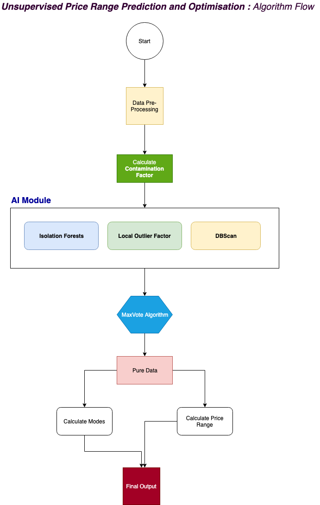

# Price-Range-Prediction
An Ensembled Unsupervised learning approach to optimal price range determination. Ongoing project for IndiaMART

Language Used: Python 3.6

To run locally:

	1. open Terminal/Command Prompt
	2. execeute "pip install -r requirements.txt"
	3. python indiamart_master.py

Other Ways to Run:
	
	1. open Terminal/Command Prompt
	2. execeute "pip install -r requirements.txt"
	2. Open IndiaMART_Master.ipynb on Jupyter Notebook
	3. Adjust path to data files t1,t2 and t3
	4. Execute Program

	Or

	1. Open indiamart_master.ipynb on Goolge Colab

